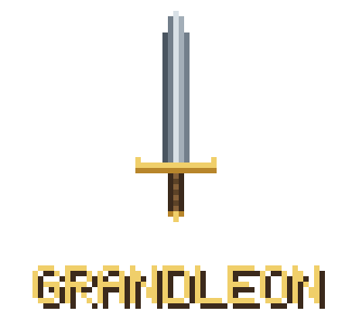
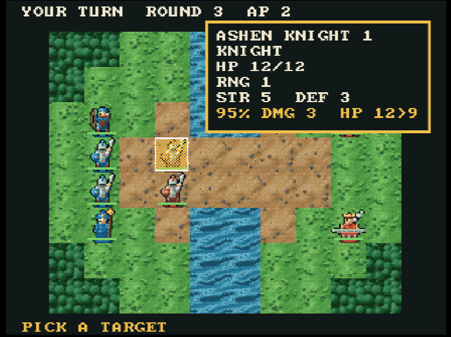
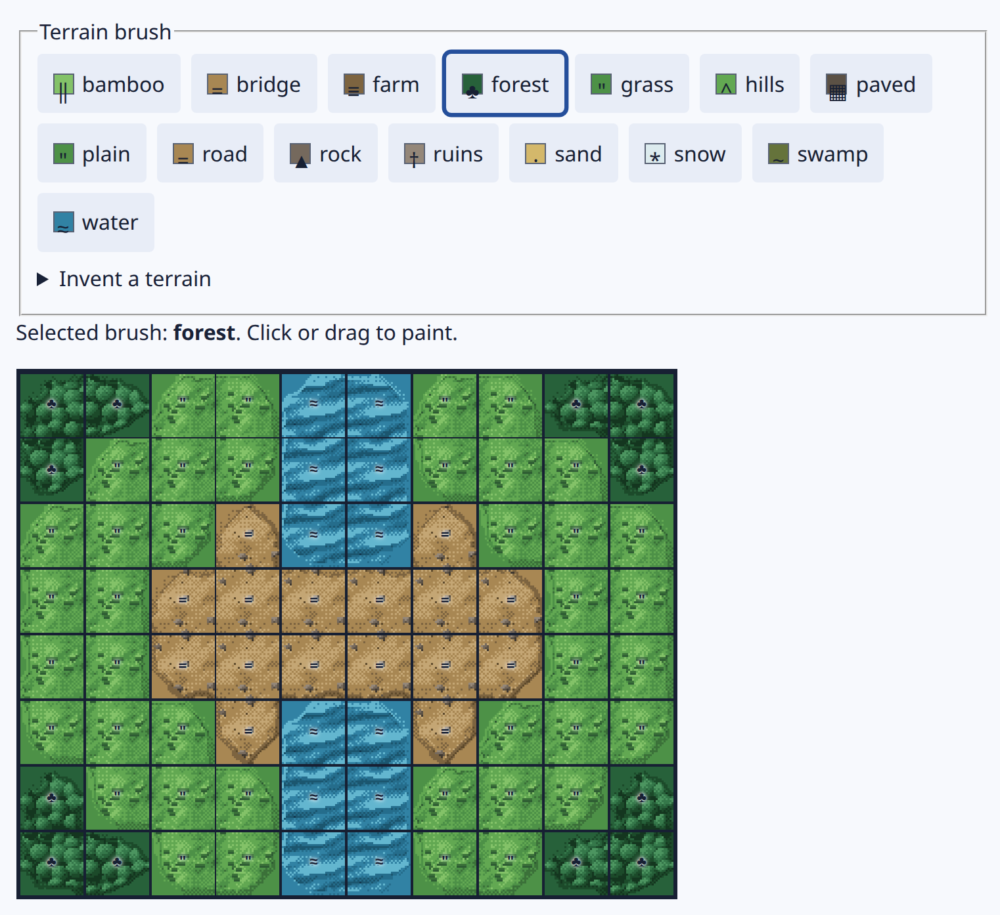
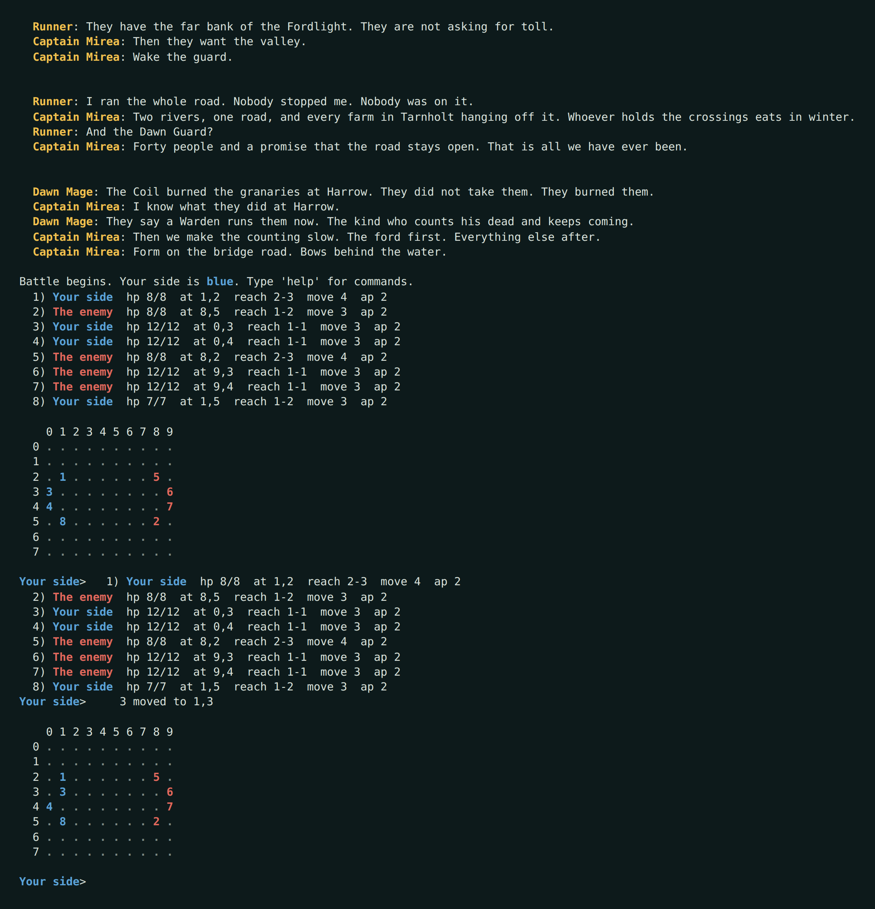
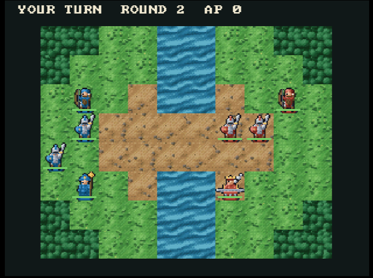
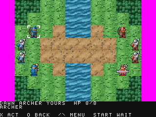
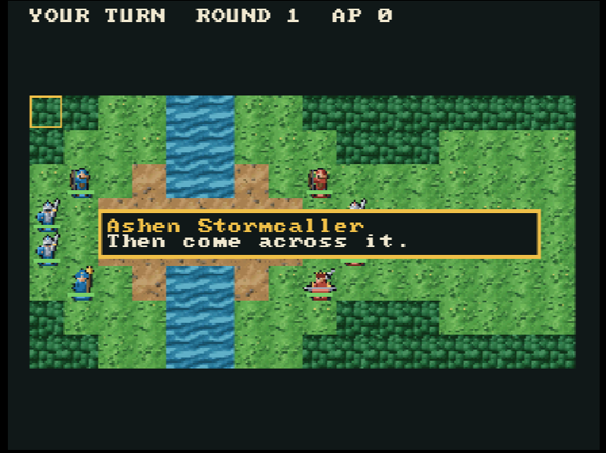

<p align="center">
  
</p>

# Grandleon - Tactical RPG Engine

Grandleon is a tool for making tactical role-playing games, and a portable
engine for playing them.

You draw maps, make characters, give them weapons, abilities and items, decide
what winning means, and chain the Stages into a campaign, all in your local browser.

## Make a game

You need Node.js 22.12 or newer.

```sh
npm ci --prefix editor
npm run --prefix editor dev
```

Open the `Editor` URL printed in the terminal, normally
`http://<machine-name>.local:5173/`. The server listens on the local network, so
a tablet on the same Wi-Fi can open that address too; if the hostname does not
resolve, use one of the LAN IP addresses Vite prints beside it. Add
`-- --port 4891` to that second command to move it off 5173.

The start screen offers two example games beside **Open this example**:

| | |
|---|---|
| **The Tarnholt Line** | Six maps, two sides, and a story in between. |
| **The Bridge at Dawn** | One small fight, whole. The shortest game there is. |

Either one opens as an unsaved working copy, so you can change anything in it
without harming the original. Press **▶ Play** to play what is on the screen.
**Start a new game** starts from nothing, **Open a project file** reads a
project archive back in, **Save** keeps the working project in this browser,
**Validate** checks the whole thing for schema errors and broken references, and
**Export** downloads it as a portable archive you can move to another machine.

[docs/CREATING_A_GAME.md](docs/CREATING_A_GAME.md) walks the whole job in
screenshots, from an empty game to a playable Stage.

## One game, every screen

One authored game, compiled once, plays on a Nintendo 64, on a PlayStation, in a
browser and in a terminal, with the same rules, the same numbers, the same board.



| The map, in the editor | The same map, terminal client |
|---|---|
|  |  |
| **The same map, Nintendo 64** | **The same map, PlayStation** |
|  |  |

A character can speak while the battle is on, over the board rather than on a
page of its own, beside whoever is talking:



No screenshot above was recorded by hand: every still and animation of a
running client is produced by `scripts/readme-screenshots.sh`, and the console
imagery comes out of the checks themselves, so it cannot show something the
code does not do.

[docs/screenshots/README.md](docs/screenshots/README.md) has the rest of the
pictures, including a whole turn played by the test that checks it.
[docs/FROM_EDITOR_TO_CONSOLE.md](docs/FROM_EDITOR_TO_CONSOLE.md) describes the
path from a choice made in the editor to a pixel on a console, and what each
layer of verification proves.

## What a game is made of

Everything you author is grouped by what you are trying to do: **Game**,
**Characters**, **Weapons & items**, **Maps**, **Stages**, **Scenes**, and
**Flow**. Underneath those sit twelve collections: classes, characters, weapon
types, weapons, item types, items, maps, factions, abilities, objectives,
campaigns, and scenes.

- A **map** is a grid of terrain. Every cell is open ground, water, or heights,
  and a character crosses water or heights only if it is the sort of character
  that can. A flier crosses everything. A cell it may enter still charges it:
  ordinary ground, or heavy going at twice the price.
- A **character** has health, strength, magic, defence, resistance, speed,
  skill, luck, evasion, a movement allowance, action points (two is what lets
  it move and then strike), and the list of weapons it carries.
- A **weapon** has power, an accuracy, and a reach band: the closest and
  furthest distance it can strike from.
- An **ability** is aimed at a tile rather than a unit. It has power, an
  accuracy, a physical or magical damage type, and a shape: one tile, a cross,
  or a diamond of the radius you give it. A damaging one covers whatever its
  shape covers and hurts only the other side, so a blast is aimed at ground
  without being aimed at your own line. An ability can restore health instead of
  taking it, and a restoring one mends whoever is standing in it.
- An **objective** decides what winning means: defeat everyone, defeat a
  particular character, keep a particular character alive, or hold out for an
  authored number of rounds.
- A **Stage** is a fight on a map: who stands where, what winning means, and
  what is said on the way in. The map is ground and holds nobody, so one map can
  carry several Stages.
- A **campaign** strings Stages and story scenes together, and a Stage's exits
  can be conditional on which objectives were satisfied and which failed (all
  of these, any of these, none of these), so a campaign branches on what
  actually happened rather than on a counter somebody remembered to increment.
- **Presentation** is a set of choices rather than a pile of files. A project
  picks a terrain theme, a character style, and a colour for each faction out of
  a library this repository generates; archetypes are drawn in every
  combination, and the choice travels inside the compiled package, so a console
  draws the game you chose without being told separately what it looks like.
  Replacing that art with your own drawing works as a mechanism, but still
  needs work to be done in a way that is future proof. **TODO**: animation and
  the 3D mesh story have to be settled first.

## What a Stage does

A Stage is a board, two sides, and a short vocabulary the engine enforces
absolutely. Nothing that plays a Grandleon game re-derives any of it.

- **Moving** is a cheapest-path fill out to the character's movement allowance,
  four directions, no diagonals. Terrain decides passage *and* price: a cell is
  open, water or a climb. Walking into it costs one for road, paving, grass,
  snow or a field, two for forest, marsh, hills, rubble, bamboo or sand. A
  flier pays one everywhere. A character files past its own side and is stopped
  by the other, and nobody finishes a walk on anybody.
- **Attacking** costs the difference: `strength + weapon power − defence`, never
  less than one. A physical ability instead costs `power − defence`; a magical
  one, `magic + power − resistance`. The chance a strike lands is its accuracy
  plus the striker's skill and luck, minus the target's evasion and luck.
- **A defender that survives strikes back** immediately, inside the same
  command, if its own reach band covers where the attack came from. A blow
  certain to kill is answered by nobody. A counter is free: it costs no action
  point and no place in the turn order. Abilities provoke nothing.
- **Talking** reaches one tile and costs an action point, and it takes the
  character spoken to off the board alive: departed, not defeated. It raises
  the world flag the author put on that placement, which is what a campaign
  branch reads to recruit them, open a map, or both.
- **A character who endures** cannot be felled. A blow, a counter or a cast
  leaves them standing at one health, and the forecast says so before it lands.
  It is authored per character, for a campaign nobody is meant to lose.
- **The forecast is a promise.** Before you commit an attack the engine prices
  both halves of it (what the target loses, what the counter takes back, and
  how often each lands) using the same code that will resolve it. The chance
  shown is exactly the chance rolled against.
- **The danger zone** is every tile the other side could reach and strike
  before you act again: movement plus every weapon band and every damaging
  ability, honouring minimum reach, narrowed by terrain, and budgeted by what
  each character has left to spend.
- **Deployment**, when a Stage authors a region for it: before anybody
  acts, the player stands their own characters on the tiles the author offered,
  and the fighting begins because the player says so.
- **Reinforcements**, when a Stage authors them: a placement can enter on
  a later round instead of standing on the board from the opening, and can
  return as a recurring wave (every so many rounds, a fixed number of times).
- Turn order is alternating activations, whole-side blocks, or by speed.
  Characters the player is not steering act for themselves: hold ground,
  patrol, or pursue.

Two rules draw a random number and no others: a strike can miss (an attack, its
counter, or a damaging cast) and a defeated character can leave something
behind. The miss rolls against the chance the forecast showed. Both draw from a
deterministic stream that is part of the Stage's authoritative state.

## Source, projects and packages

- `project.json` is the canonical, readable authoring format. It is what belongs
  in source control, and it is what the editor reads and writes. Its fields are
  described in `schemas/source/v1/`.
- `.grandleon.zip` is the editor's portable project archive: everything a
  project needs, in one file you can move or send.
- `.gpk` is the compiled, versioned package the runtime plays. It is a format
  probe, not yet a compatibility commitment: `engine/package_format/README.md`
  holds the open questions.

Do not treat `.gpk` as editable source. Compilation checks compatibility, stable
identities, references, map bounds, and the gameplay vocabulary the runtime can
execute. Content it cannot execute is rejected rather than silently discarded,
so a package that loads is a package that plays.

## Build it from the command line

The package compiler and the native runtime need CMake 3.20 or newer and a
C++17 compiler.

```sh
cmake -S . -B build -DGRANDLEON_BUILD_TESTS=OFF
cmake --build build
./build/grandleon_content_compile games/demo/source/project.json build/grandleon-demo.gpk
./build/grandleon_package_check build/grandleon-demo.gpk
```

`grandleon_play` plays a compiled package in a terminal, or in a window with
`--sdl`. The window is a single sitting only; a kept campaign is terminal-only.
Give it a save slot and it plays a campaign you keep: the roster joined to
every board, the permanently dead left off later ones, levels and growth rolls
and drops narrated between Stages:

```sh
./build/grandleon_play build/grandleon-demo.gpk --campaign=demo_campaign
./build/grandleon_play build/grandleon-demo.gpk --campaign=muster_road --slot=road
./build/grandleon_play build/grandleon-demo.gpk --campaign=muster_road --slot=road --resume
```

The whole packaged demo (canonical source through compilation, loading, combat,
victory, and campaign advancement) runs as one test. The test suite needs Node
as well:

```sh
cmake -S . -B build -DGRANDLEON_BUILD_TESTS=ON && cmake --build build
ctest --test-dir build -R grandleon.game_demo --output-on-failure
```

A game is a separate package consumer rather than something linked into the
engine. See [games/demo/README.md](games/demo/README.md) and
[games/tarnholt/README.md](games/tarnholt/README.md) for the two maintained
games, and [games/template/README.md](games/template/README.md) for the reusable
skeleton.

### A PlayStation disc

`cmake --build build --target grandleon_playstation_disc` writes
`build-playstation/disc/grandleon.bin` and `grandleon.cue`: the Tarnholt Line
campaign as a disc image. Both files, because burning software needs the cue to
know what the bin is.

**A disc of your own game** is the same build with one path changed. The editor's
**PlayStation disc** button asks the local build service for one, exactly as
**Nintendo 64 ROM** asks it for a cartridge; from a shell it is
`platform/playstation/scripts/build-playstation.sh --project <your project.json>`
followed by `build-disc.sh`. Nothing is patched into a pre-built image, so what
comes out is the checked build rather than something required to resemble it.
[tools/rom_service/README.md](tools/rom_service/README.md) has the route and
every refusal it makes by name.

It needs **a container runtime**, like every console and WebAssembly target: the
PlayStation toolchain is a pinned, digest-verified image rather than something
to install. [docs/SETUP.md](docs/SETUP.md) has the details, including how to
name a runtime that is not `docker`.

The image carries **no licence sector**, because that data is Sony's.
Emulators do not look for one: `grandleon_playstation_disc_check` boots this
image in PCSX-Redux and plays the campaign off it. A stock PlayStation does
look, and will refuse the disc.

## What is not here yet

This is an early development version, not a finished engine. Plenty of work is still needed, including improving graphics and rendering, gameplay changes, etc. If you notice anything you think would be good to change, please file an issue with a request or, even better, submit an improvement.

## Where to go next

| If you want to… | Read |
|---|---|
| make a game | **Make a game** above, then [docs/CREATING_A_GAME.md](docs/CREATING_A_GAME.md). The editor is the tool, and it explains each field as you fill it in |
| build or port the engine | [CODING.md](CODING.md), then [docs/FROM_EDITOR_TO_CONSOLE.md](docs/FROM_EDITOR_TO_CONSOLE.md), then one `platform/*/README.md` |
| know what the engine guarantees | the module READMEs under `engine/` and `platform/`, and the tests beside them. A guarantee here is a thing a named test holds, not a paragraph |
| understand why it is built this way | [DESIGN.md](DESIGN.md): the architecture and the reasoning behind it |
| contribute | [CONTRIBUTING.md](CONTRIBUTING.md) |

Every module under `engine/`, `platform/`, `tools/`, `games/` and `editor/`
carries its own README describing what it owns.

## Built on

None of the console work would exist without these. Each is pinned by commit or
by image digest and verified before every build, so the version named here is
the version that produced the ROMs.

| | | Pinned at |
|---|---|---|
| [libdragon](https://github.com/DragonMinded/libdragon) | the Nintendo 64 toolchain and runtime | `35f85a07` |
| [ares](https://github.com/ares-emulator/ares) | the emulator every Nintendo 64 check runs under | `0aafd857` |
| [Nugget](https://github.com/pcsx-redux/nugget) | the PlayStation SDK | `e5d63b8e` |
| [mkpsxiso](https://github.com/Lameguy64/mkpsxiso) | writes the PlayStation disc image | `54fb1644` |
| [PCSX-Redux](https://github.com/grumpycoders/pcsx-redux) | the PlayStation emulator, and the OpenBIOS its checks boot | `a415a98e` |
| [Emscripten](https://github.com/emscripten-core/emscripten) | the engine compiled to WebAssembly for the browser | `emsdk:4.0.23` |

The editor and the tooling are built on
[Vue](https://github.com/vuejs/core),
[Vite](https://github.com/vitejs/vite),
[TypeScript](https://github.com/microsoft/TypeScript),
[Ajv](https://github.com/ajv-validator/ajv),
[Vitest](https://github.com/vitest-dev/vitest),
[Playwright](https://github.com/microsoft/playwright) and
[Pillow](https://github.com/python-pillow/Pillow), which draws every generated
sprite.

Each carries its own licence. The only one this repository carries a piece of is
Emscripten: the checked-in WebAssembly module links in its LLVM runtime. See
[NOTICE](NOTICE).

## Author(s)

- Luis Felipe Strano Moraes (luis.strano at gmail dot com)
- Your name here 🙂

## License

Released under the [MIT License](LICENSE).
