# Creating a game

A game is characters, ground to fight on, **Stages** fought on that ground, and
the order the Stages happen in. One pass through it, in the order you would
do it.

Every picture is taken by `scripts/guide-shots.mjs` driving the real editor
through exactly these steps, and the gate fails if one stops matching.

## Open it

```sh
npm ci --prefix editor
npm run --prefix editor dev
```

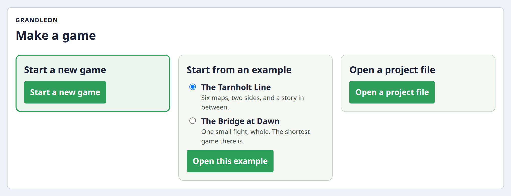

To see a finished game instead of building one, open an example and press
**▶ Play**. It opens as your own copy; the original is not touched.

## Name it

**Start a new game** opens on Game.

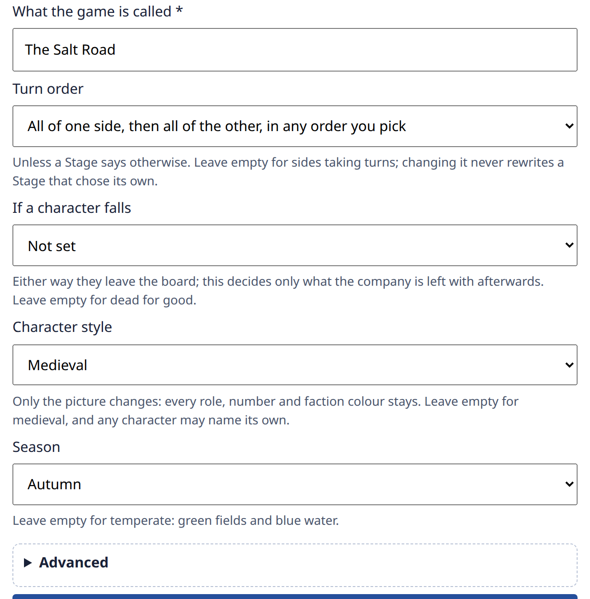

Five questions, and every one of them can be answered before anything else
exists. The three under the turn order (what happens when a character falls,
the style the characters are drawn in, the season the ground is drawn in) are
game-wide defaults, and none is a restriction: a medieval campaign can field an
undead enemy.

**Advanced** holds the two names that are for a machine rather than for a
player: the game id, which the exported file is named after and which follows
the title until you write one yourself, and the content revision, which you
raise when you change content a saved game reads. Neither needs an answer to
make a game.

## Make somebody

Characters → **New character**. Whose side, what kind, what they are called.

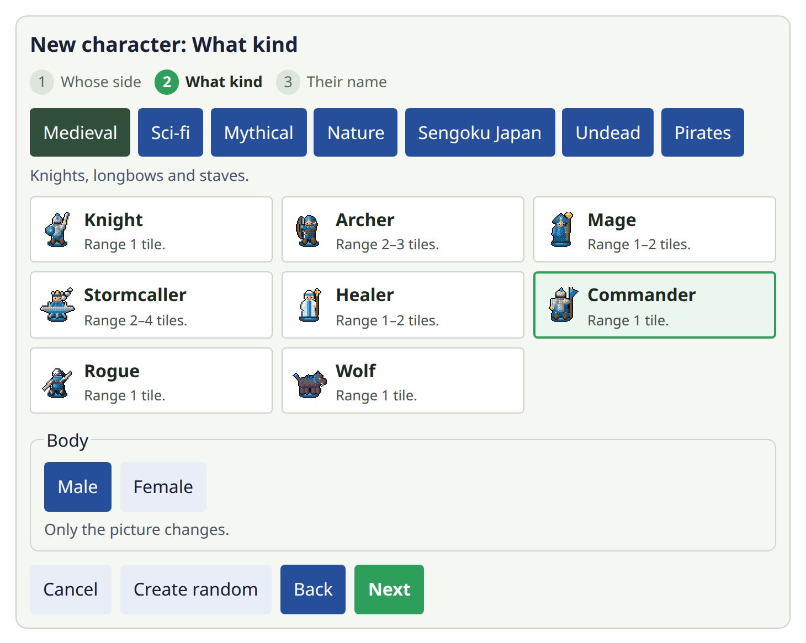

A card says the one number that changes which role you pick. The rest of a
character's numbers are read on the character. A setting changes the names and
the picture, never what you may make.

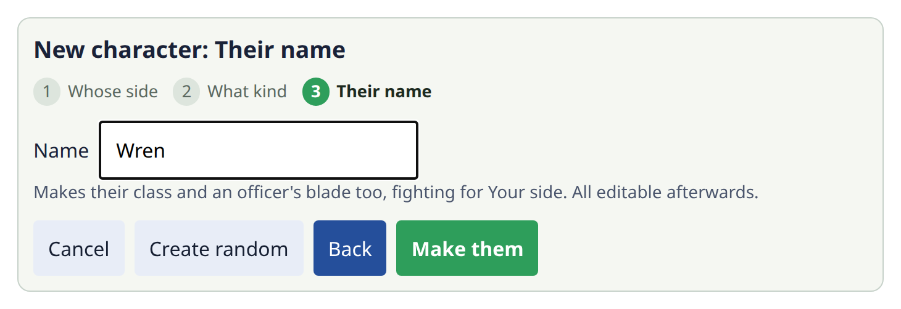

Writing it is one act: one undo takes all of it back.

## Draw ground

Maps → **Create map**. Click or drag to paint, or arrow keys and Enter.

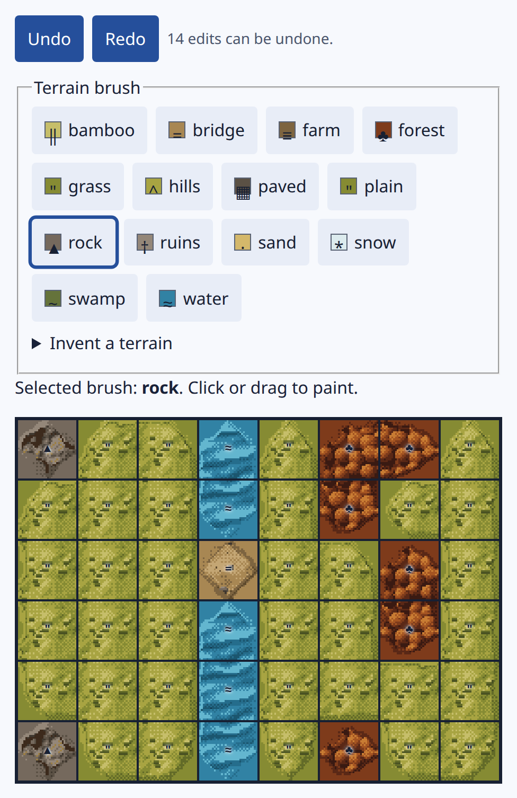

Maps can be reused in several Stages.

Fourteen brushes cover everything the art library draws. **Invent a terrain**
takes a name of your own, and says how it will be drawn and walked over before
you use it. A name matching none of the fourteen is drawn flat and walked like
open ground.

A drag repaints every cell it crosses, so one careless stroke is dozens of
edits. The undo depth is bounded, and the row above the grid says how much is
still held.

## Set up a Stage

A **Stage** is a fight on a map. Pressing **Make a Stage on this ground** on the
map you just drew carries the ground across, so it is not asked for twice.

Then fill the board. You do not have to have made anybody first.

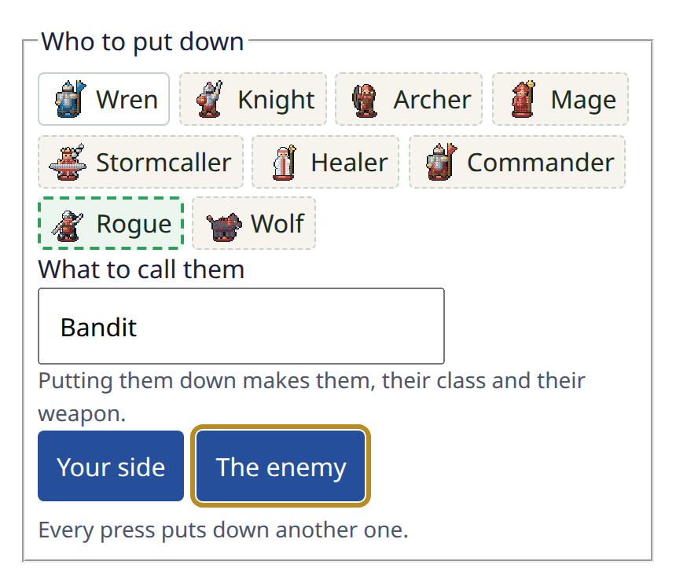

The dashed entries are characters this game has not got. Press a tile holding
one and it is made and standing there: one act, one undo. The next press puts
down another of the same Bandit rather than a second Bandit.

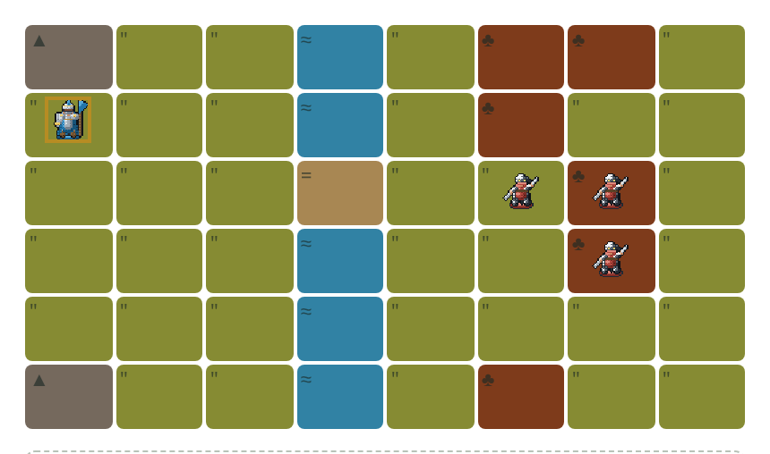

Four presses.

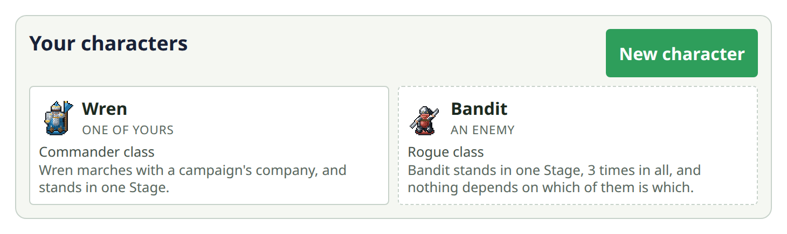

Nobody was asked who matters. Wren is held by name in a company, so she is a
person and stands in one place. The bandits are only ever placed, so they are
extras, and three of them are three placements of one.

## Say how it ends

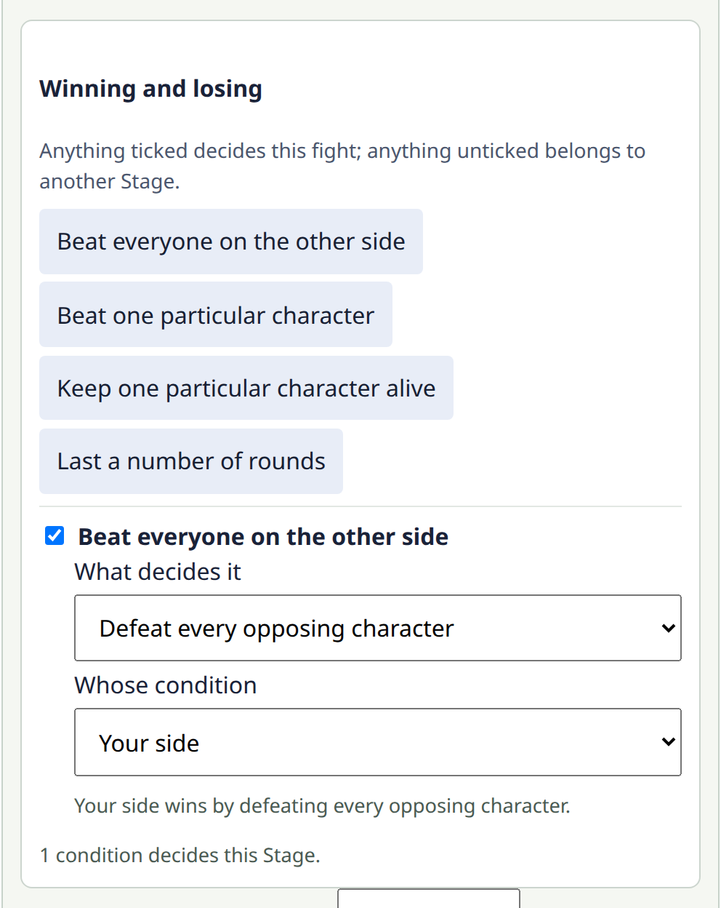

A Stage can use more than one. Anything left unticked belongs to a different
Stage and does nothing here.

## Put them in order

Flow draws the campaign as stops on a road.

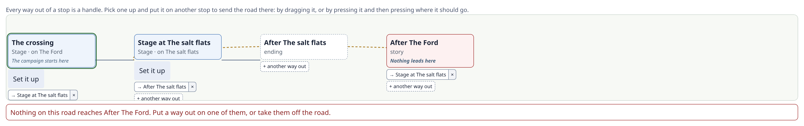

Making each Stage also made the stop after it, so the road is joined up before
you touch it. Dragging is for changing it: here the first Stage has been sent
straight at the second, and the story beat between them is now reached by
nothing. The graph says so, in the stop and again underneath.

## Play it

**▶ Play**, at the top of every screen.

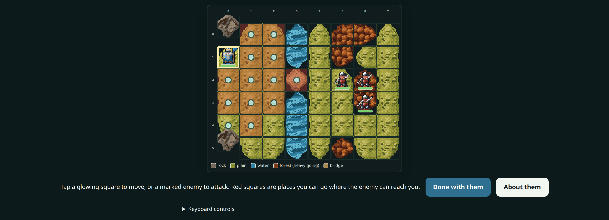

The engine the Nintendo 64 and PlayStation builds run, compiled to
WebAssembly: the same rules, the same numbers, the same board.

## Take it away

- **Save** keeps the project in this browser. No account, and nothing leaves the
  machine.
- **Export** downloads it as a `.grandleon.zip`, which **Open a project file**
  reads back.
- **Nintendo 64 ROM** builds a `.z64`, and **PlayStation disc** builds a `.bin`
  and the `.cue` that goes with it, downloaded together as one zip. Both need
  the local build service running (`node tools/rom_service/serve.mjs`) and the
  editor opened at a `localhost` address rather than at the machine's network
  name; the port does not matter. Without either, the buttons are disabled and
  say why.

  **A disc is not the same offer as a cartridge, and the difference is worth
  reading before you burn one.** The image carries no licence sector, because
  that data is Sony's and none of it is fetched or vendored here. It boots in
  PCSX-Redux, which is what the gate proves; a stock PlayStation reads the
  licence area, finds nothing, and refuses the disc. Nothing in this repository
  has ever run on real hardware of either console, so what any other machine
  that reads a disc does with it is not something this project says.

[FROM_EDITOR_TO_CONSOLE.md](FROM_EDITOR_TO_CONSOLE.md) is the rest of that road.

## Refreshing these pictures

```sh
npm run --prefix editor build
node scripts/guide-shots.mjs            # rewrite them
node scripts/guide-shots.mjs --check    # or compare, which is what the gate runs
```

The walk is deterministic, so the check is byte for byte. It fails two ways, and
both matter: a click that no longer lands means this page describes an editor
that is gone, and a picture that no longer matches means it shows one.
