# Unit roster review

<!-- Generated by tools/placeholder_art/generate.py. Do not edit. -->

One row per unit: every archetype in every style, its two-dimensional art beside its three-dimensional art. `GALLERY.md` cuts the same
library by asset kind, and is the page to read to see what a profile costs or what a transition looks like. This one exists to be judged:
8 archetypes times 7 styles is 56 units, and this is all of them, in one table, at one size.

## Coverage

- **2D: 56 of 56.** Every archetype is drawn in every style, standing and in motion, in all six faction colours. The registry refuses a style that is missing one.
- **3D: 56 of 56.** A mesh is an *additional* drawing of an archetype and not a cell of the sequence every style must ship, so an archetype
  without one is not an incomplete archetype. But it is an empty cell here, and the empty cells are half of what this page is for.

| Style | 2D units | Meshes |
| --- | --- | --- |
| Medieval | 8 of 8 | 8 of 8 |
| Sci-fi | 8 of 8 | 8 of 8 |
| Mythical | 8 of 8 | 8 of 8 |
| Nature | 8 of 8 | 8 of 8 |
| Sengoku Japan | 8 of 8 | 8 of 8 |
| Undead | 8 of 8 | 8 of 8 |
| Pirates | 8 of 8 | 8 of 8 |

## How to read a row

The 2D half carries three things, and each is there for a different question. The **standing sprite**, largest, is the unit's identity and is
frame 0 of every sequence it has. The **four animation cells** beside it, at half that size, are what make it a unit rather than a portrait: a
pose is applied to the body the archetype's own routine drew, so the question they answer is whether it stays the same figure while it moves.
The **six faction colours**, at native size, are asked to prove only that the recolouring holds. The whole menu at every profile is a section of
`GALLERY.md`, and repeating it here at any larger size would have pushed the 3D half of the row off the side of the page.

All of it is drawn at the reference profile in `blue`, which is the faction every other measurement in this pipeline is taken on.

## The 3D column, and what it is not

Each mesh is rendered **from the exported model** (`assets/gltf/<style>/<archetype>.gltf` and its buffer) and not from the part tables the
exporter wrote it from. The corners, the per-face normals, the far-to-near part order and each face's ramp and rung all come out of the file; the
ramp's colours come from the same resolution the console's own header is built with. So the picture is an end-to-end check on the export as well as
on the art: a model that lost a part, smoothed a normal or shuffled its order comes out as a wrong picture, which is the one failure a round trip
over the same integers cannot notice.

The camera is the shipped one: 60 degrees off the board plane, the shipped focal length and distance. A mesh that reads at another angle is not
evidence about the one the game draws. At that camera the machine draws a figure between twenty-five and forty-one pixels tall depending where on the board it stands, so these are upscaled by nearest
neighbour 4 times, exactly as every sprite on these pages is. The outline under each figure is one board tile at the same camera.

**These are previews and not screenshots.** The console draws these meshes for real in `platform/playstation/scratch/grandleon_playstation_scratch3d`,
and `platform/playstation/scratch/evidence/` holds its own photographs of them on a board. This renderer was checked against those captures rather than
trusted: redrawing `evidence/mesh-beside-billboard.png` with the same projection puts the knight 25, 37 and 41 pixels tall at the near, middle and far
rows, which are the three heights that still's own notes record, and 88 per cent of the pixels it paints carry one of the model's own face colours there. Two differences remain and
both are deliberate: the console additionally scales each unit to its own sprite's opaque silhouette at draw time, which is a property of placing a unit
on a board rather than of the model, and its rasteriser is its GPU's rather than this one's. An edge pixel here and there falls on the other side.

## The roster

| Style | Unit | 2D: standing, in motion, recoloured | 3D mesh |
| --- | --- | --- | --- |
| Medieval | **Knight** | 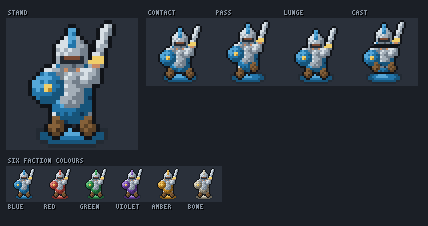 | 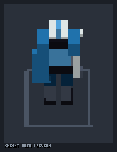 |
| Medieval | **Archer** | 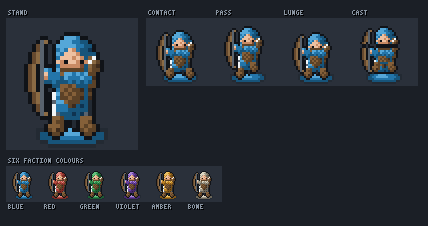 | 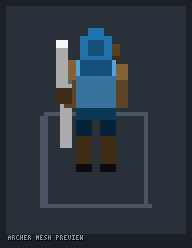 |
| Medieval | **Mage** | 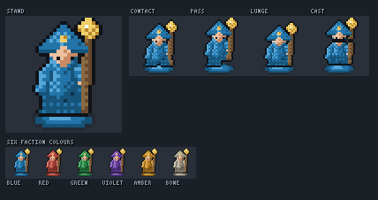 | 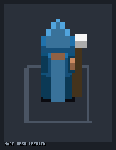 |
| Medieval | **Stormcaller** | 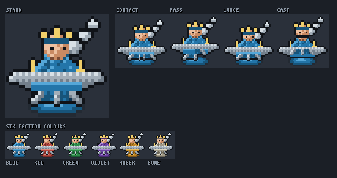 | 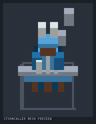 |
| Medieval | **Healer** | 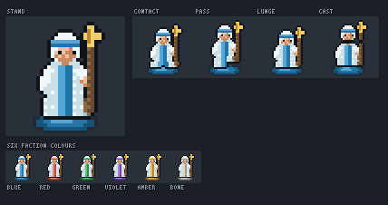 | 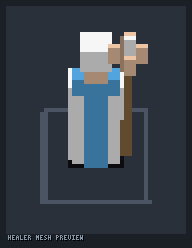 |
| Medieval | **Commander** | 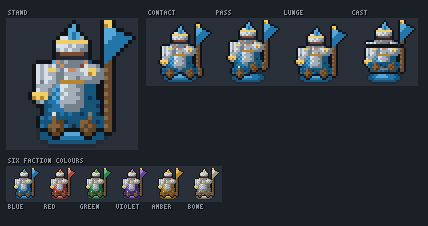 | 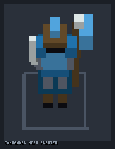 |
| Medieval | **Rogue** | 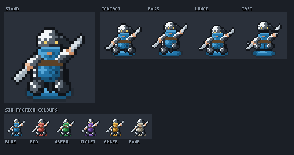 | 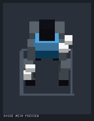 |
| Medieval | **Beast** | 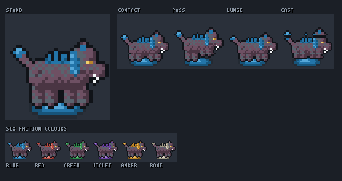 | 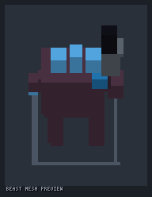 |
| Sci-fi | **Knight** | 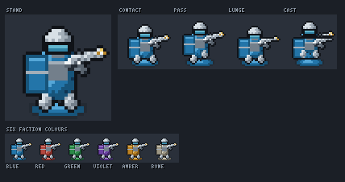 | 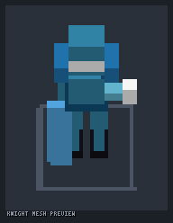 |
| Sci-fi | **Archer** | 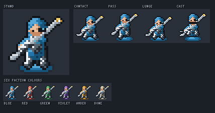 | 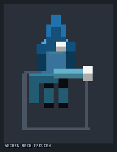 |
| Sci-fi | **Mage** | 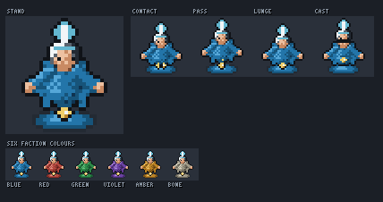 | 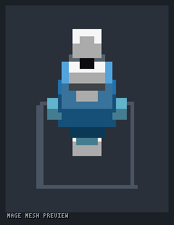 |
| Sci-fi | **Stormcaller** | 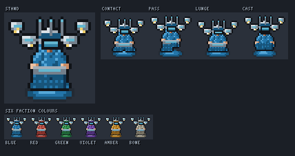 | 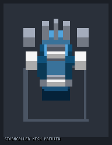 |
| Sci-fi | **Healer** | 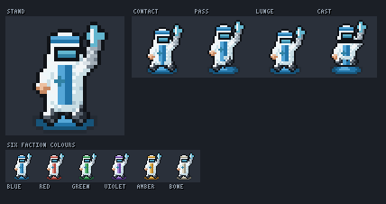 | 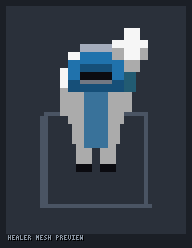 |
| Sci-fi | **Commander** | 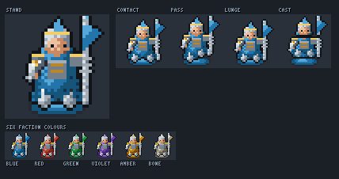 | 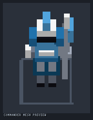 |
| Sci-fi | **Rogue** | 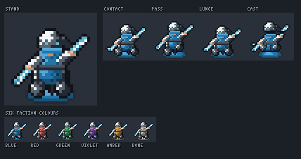 | 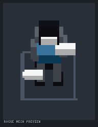 |
| Sci-fi | **Beast** | 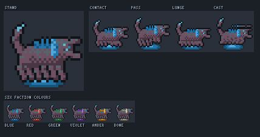 | 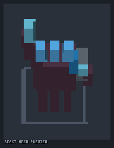 |
| Mythical | **Knight** | 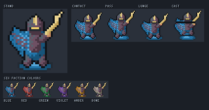 | 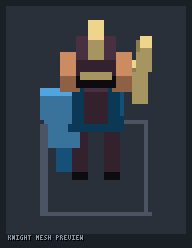 |
| Mythical | **Archer** | 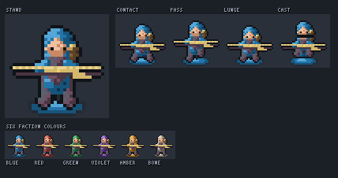 | 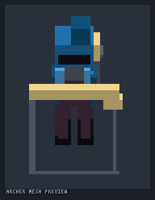 |
| Mythical | **Mage** | 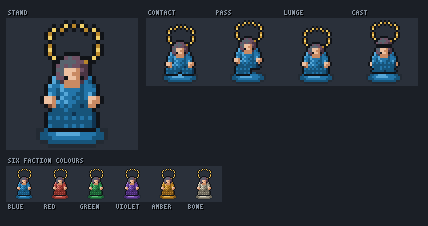 | 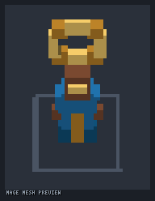 |
| Mythical | **Stormcaller** | 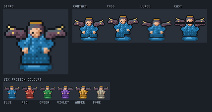 | 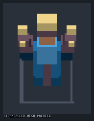 |
| Mythical | **Healer** | 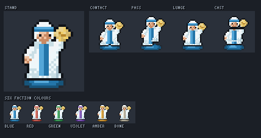 | 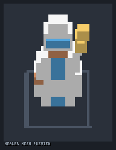 |
| Mythical | **Commander** | 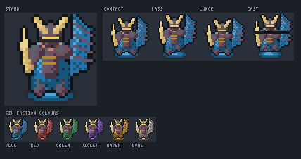 | 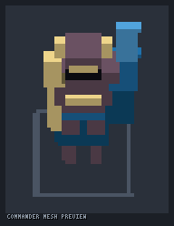 |
| Mythical | **Rogue** | 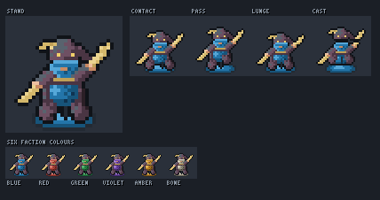 | 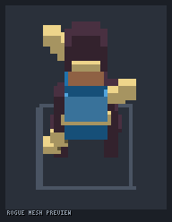 |
| Mythical | **Beast** | 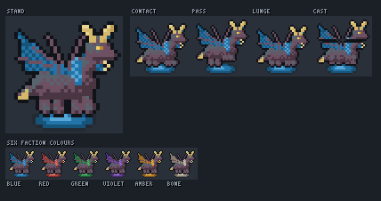 | 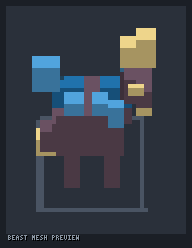 |
| Nature | **Knight** | 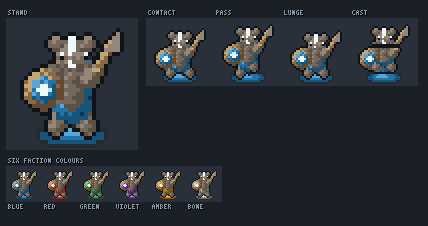 | 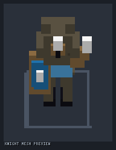 |
| Nature | **Archer** |  |  |
| Nature | **Mage** |  |  |
| Nature | **Stormcaller** |  |  |
| Nature | **Healer** |  |  |
| Nature | **Commander** |  |  |
| Nature | **Rogue** |  |  |
| Nature | **Beast** |  |  |
| Sengoku Japan | **Knight** |  |  |
| Sengoku Japan | **Archer** |  |  |
| Sengoku Japan | **Mage** |  |  |
| Sengoku Japan | **Stormcaller** |  |  |
| Sengoku Japan | **Healer** |  |  |
| Sengoku Japan | **Commander** |  |  |
| Sengoku Japan | **Rogue** |  |  |
| Sengoku Japan | **Beast** |  |  |
| Undead | **Knight** |  |  |
| Undead | **Archer** |  |  |
| Undead | **Mage** |  |  |
| Undead | **Stormcaller** |  |  |
| Undead | **Healer** |  |  |
| Undead | **Commander** |  |  |
| Undead | **Rogue** |  |  |
| Undead | **Beast** |  |  |
| Pirates | **Knight** |  |  |
| Pirates | **Archer** |  |  |
| Pirates | **Mage** |  |  |
| Pirates | **Stormcaller** |  |  |
| Pirates | **Healer** |  |  |
| Pirates | **Commander** |  |  |
| Pirates | **Rogue** |  |  |
| Pirates | **Beast** |  |  |
