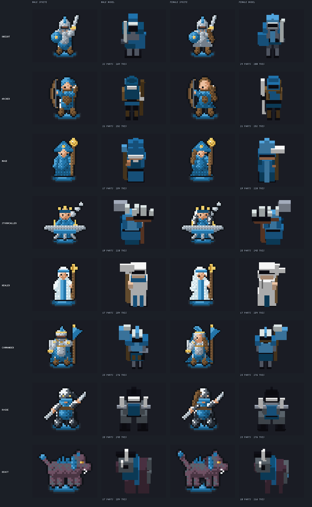
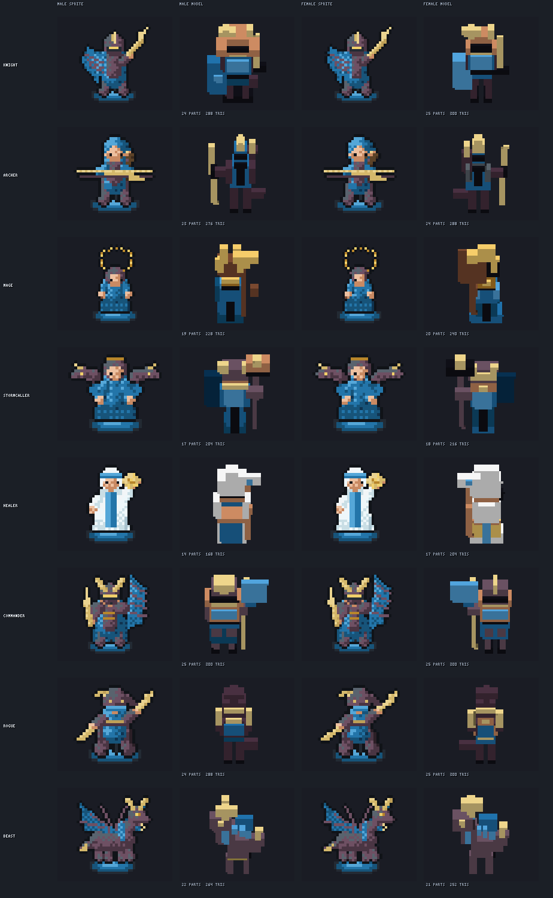
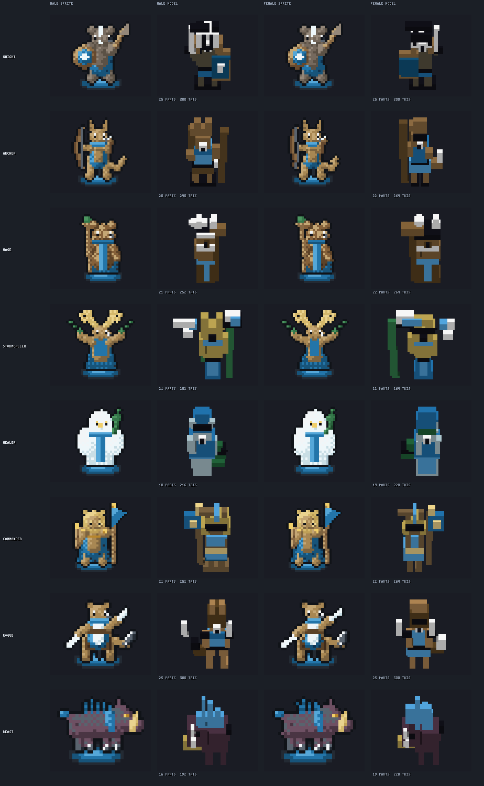
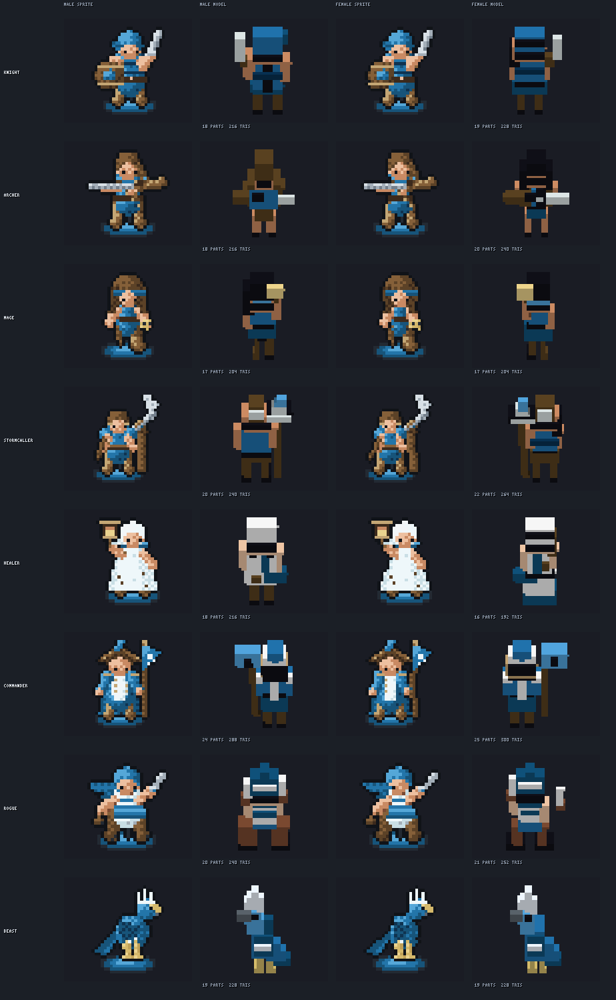
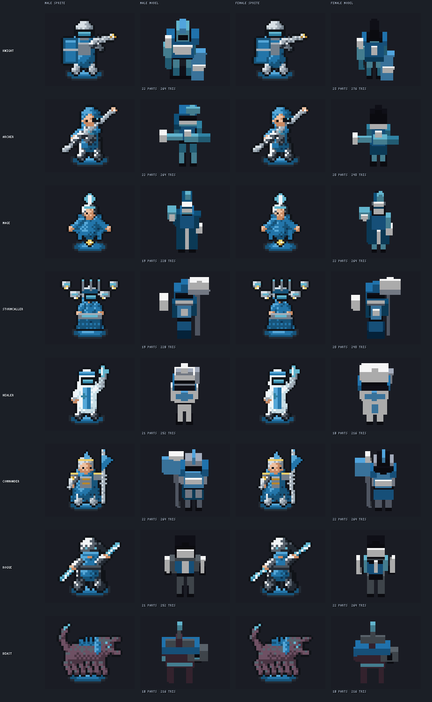
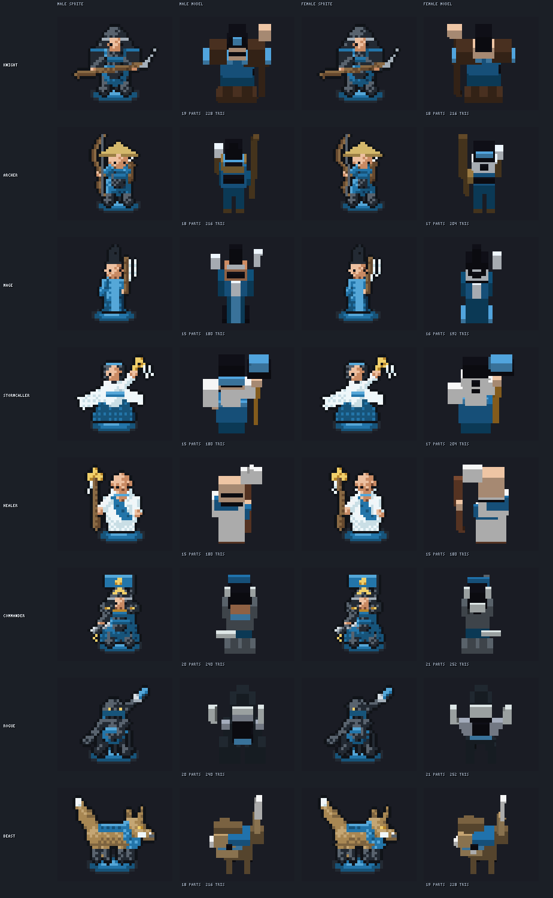
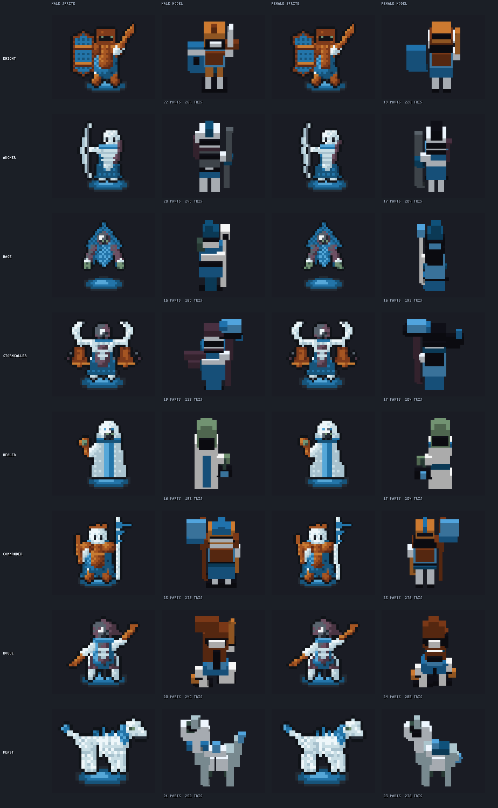

# The roster, drawn both ways

<!-- Generated by tools/placeholder_art/roster_comparison.py. Do not edit. -->

Every role in every style, drawn as the sprite the board has always shown and as the solid that can replace it, with both bodies.

## How to read it

Both drawings are brought to the same **132-pixel figure height** and magnified by nearest neighbour, never filtered. Matching the height is the whole discipline of the page: the model stands about twice as tall in its board cell as the sprite does in its 32-pixel one, so showing each at its native framing makes the model larger and the comparison worthless. The board tile under each model is excluded when its height is measured, because a floor is not part of a figure.

The sprites are shown **after** the console's own reduction and 16-colour bank, not as their full-colour masters, so what is on this page is what the hardware draws.

## What it shows

At matched size, **the sprite currently reads better than the model on most roles**, and the gap is widest exactly where a role is identified by something small: the archer's drawn bow, the mage's staff and orb, the rogue's dagger, the beast's legs and tail. A box approximation keeps the mass and loses the read.

It is not uniform, and the exceptions are informative. The **undead** roster is the closest of the seven, because its sprites are already skeletal and boxy, so little is lost in the approximation — its beast reads plainly as a four-legged skeleton. The **medieval** and **nature** rosters lose the most, because their sprites carry the most rounded detail. Whatever fixes this will be worth measuring per style rather than once.

Three causes are visible on this page, and they are structural rather than a matter of tuning:

1. **Faces are inconsistent.** Every sprite has eyes. At the shipped 60-degree pitch a head box shows the viewer mostly its top, so a face survives only where a part happens to put a dark band across the front — several undead and pirate models get one and read much better for it, while most medieval models have a bare plate. That it happens by accident rather than by rule is the finding.
2. **Held objects become slabs.** A bow, a staff and a blade are thin and mostly silhouette, which is the one thing an axis-aligned box cannot be.
3. **The two bodies read alike.** Several roles differ clearly as sprites, mostly by hair, and barely at all as models.

None of that is an argument against models — it is the list of what has to be solved, measured on the whole roster rather than on one figure. The constraint it has to be solved inside is real: no depth buffer on either console, and 150-300 triangles a figure, which is a measured thirty-frames-a-second budget rather than a stylistic choice.

## Medieval

Plate, longbows and staves: the high-fantasy roster.

## Mythical

Scale, horn and dragonfire: the same roster among dragonkin.

## Nature

Animal folk: the same roster carried by badgers, cats, bears and a boar.

## Pirates

Tar, brass and sailcloth: the same roster as a ship's crew.

## Sci-fi

Powered armour, rail rifles and drones: the same roster in a war fleet.

## Sengoku Japan

Lacquer, the naginata and the yumi: the same roster in the Warring States.

## Undead

Bone, shroud and rust: the same roster as the force a player fights.

